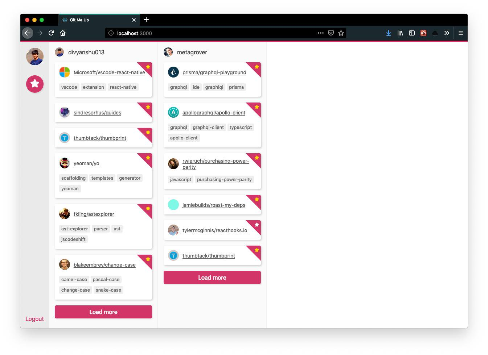

# Learn GraphQL

Project repo for our **[Learn GraphQL Series](https://www.youtube.com/playlist?list=PLMV09mSPNaQlzySXg3vmau7S46jx7Qysd)**.



## Running the app

1. Clone this repo

2. `cd` into the `code` directory:

```sh
cd code
```

3. Install dependencies:

```sh
yarn
```

4. Run the app:

```sh
yarn start
```

## Series Notes

- [Video 04 - Query](./series-notes/04-query.md)
